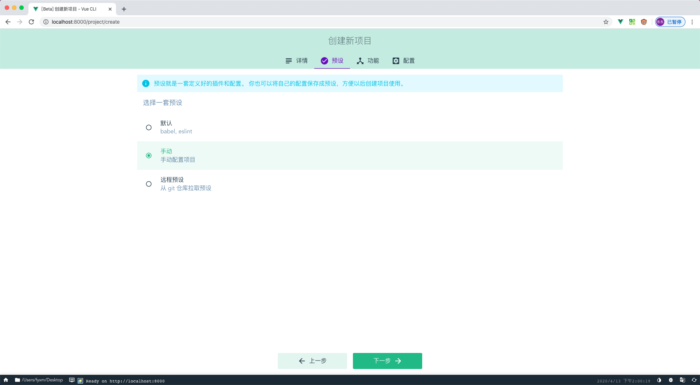
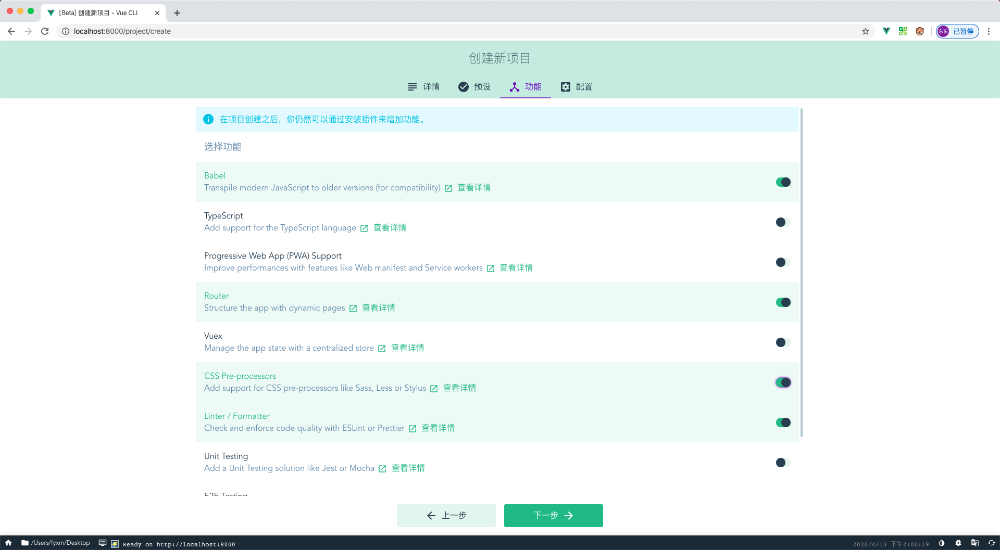
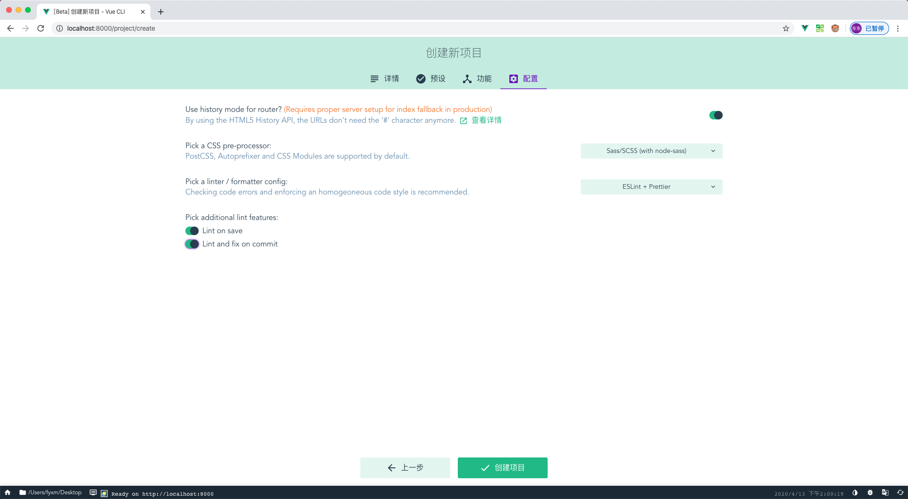
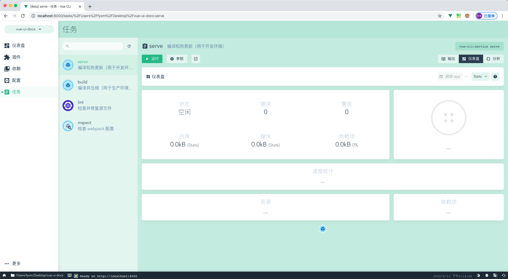
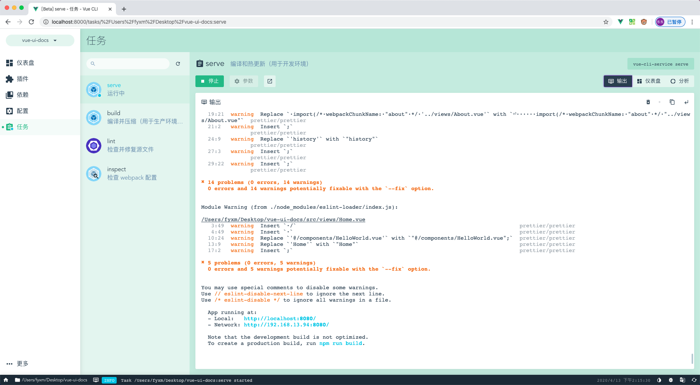

# VUE-UI-DOCS

## 创建项目

1. 全局安装 `Vue CLI` 更多内容查看[官方文档](https://cli.vuejs.org/zh/guide/installation.html)

```bash
npm install -g @vue/cli
```

2. `vue ui` 可视化操作,也可以通过 `vue crate {project}`

```bash
vue ui
```


3. 创建项目


4. 预设配置



5. 手动配置



6. 详细配置



7. 安装依赖


8. 启动项目



9. 访问地址



10. 浏览器访问


## 结构调整

1. 文件结构调整

```javascript
├─site          //示例网站目录
│ └─components  //示例网站组件
│ └─router      //路由配置
│ │ └─index.js  //路由配置文件
│ └─views       //示例页面
│ │ └─Home.vue  //示例网站首页
│ └─App.vue     //项目入口
│ └─main.js     //启动文件
├─src           //源码目录
```

2. 根目录创建 `vue.config.js` 配置

```javascript
module.exports = {
  pages: {
    index: {
      entry: "site/main.js"
    }
  }
};
```

3. 相关的依赖、路由配置进行调整，`Home.vue` 页面调整

```vue
<template>
  <h1>Home</h1>
</template>

<script>
export default {
  name: "Home"
};
</script>
```

4. 页面访问


## 文档解析

